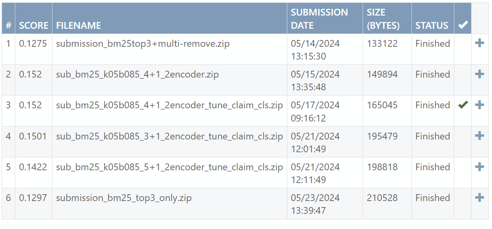

# COMP90024-Project-Top-4-Solution-Fact-Verification-System
# Project-Description
This project focuses on classifying claims into four categories: SUPPORTS, REFUTES, NOT_ENOUGH_INFO, and DISPUTED. The classification is based on evidence retrieved from a corpus containing over a million pieces of evidence. Developed by the Natural Language Processing team at the University of Melbourne, this project employs a two-stage retrieval and classification approach.

Initially, we use the BM25 algorithm for evidence retrieval. To enhance the retrieval process, we implemented a custom encoder model to identify additional relevant evidence not captured by BM25. Subsequently, another encoder model is utilized to predict the claim label based on the retrieved evidence.
# Result of the project
According to the result from the final evaluation, our approachs could achieve 0.152 overall Harmonic Mean of F and A to classify claim:

also ranked 4th in the leaderboard:

finally, Received 3 bonus mark in Project 1 since rank in top 10
